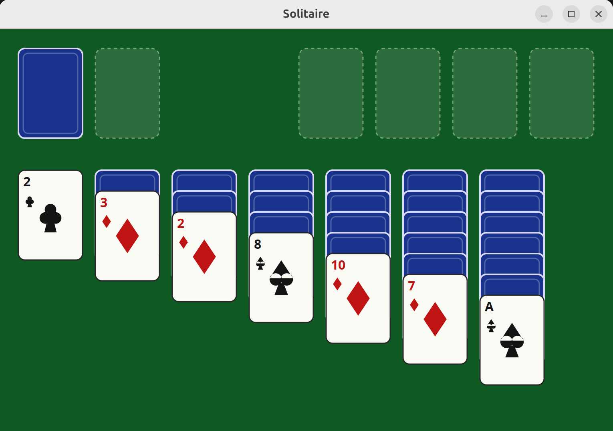

# Solitaire

A desktop Klondike Solitaire game written in C with GTK4.



## Building

Requires a C compiler, [Meson](https://mesonbuild.com/), Ninja, GTK4
development headers, and the [Check](https://libcheck.github.io/check/)
unit testing framework.

On Debian/Ubuntu:

```
sudo apt install build-essential meson ninja-build libgtk-4-dev check pkg-config
```

Then, from the project root:

```
meson setup build
ninja -C build
```

## Running

```
./build/solitaire
```

## Testing

The game model (cards, dealing, move legality, win detection) has a
unit test suite built on Check:

```
meson test -C build -v
```

## Controls

- **Stock pile** (top-left): click to draw a card into the waste pile.
  Clicking an empty stock recycles the waste back into the stock.
- **Select a card**: click a waste or tableau card to select it (shown
  with a gold outline). Click the same pile again to deselect.
- **Move a card**: with a card selected, click a legal destination pile
  (a tableau pile or a foundation) to move it there. An illegal
  destination simply clears the selection with no effect.
- **Double-click**: double-click a waste or top tableau card to send it
  straight to its foundation, if legal.
- **Undo**: `Ctrl+Z` undoes the last successful move.
- **Auto-complete**: once every tableau card is face up and the stock
  and waste are both empty, the rest of the game is played out
  automatically and a "You Win!" banner is shown.

## Architecture

The code is organized as three layers, each independently testable:

| Layer | Location | Responsibility |
|---|---|---|
| Model | `src/model/` | Cards, deck shuffling, and all Klondike rules (dealing, move legality, win detection). Pure C structs and functions; no GTK dependency. Covered by the unit test suite in `tests/`. |
| View | `src/view/` | Renders a `GameState` to a GTK4 `GtkDrawingArea` using Cairo, and provides hit-testing (screen point → pile/card) and a selection-highlight API. No game rules live here. |
| Controller | `src/controller/` | Wires mouse clicks and keyboard shortcuts to the model's move functions, and drives the view's selection highlight, undo history, and auto-complete. |

```
solitaire/
├── meson.build
├── src/
│   ├── main.c              # GTK application entry point
│   ├── model/               # Game rules (no GTK dependency)
│   │   ├── card.h / card.c
│   │   ├── deck.h / deck.c
│   │   └── game.h / game.c
│   ├── view/                 # Rendering + hit-testing
│   │   ├── board_view.h / board_view.c
│   │   └── app_window.h / app_window.c
│   └── controller/            # Input handling, undo, auto-complete
│       └── game_controller.h / game_controller.c
├── tests/
│   ├── meson.build
│   └── test_game.c
└── docs/
    └── screenshot.png
```

### Notable implementation details

- **Suits are drawn as vector shapes, not font glyphs.** An early
  version used Unicode suit characters (♣♦♥♠) rendered via Cairo's
  text API, which depends on the system's default font actually
  covering those code points. On at least one real system this
  rendered as empty "tofu" boxes. Suits are now drawn as hand-built
  Cairo paths (`draw_club`, `draw_diamond`, `draw_heart`, `draw_spade`
  in `board_view.c`), so they render identically regardless of
  installed fonts.
- **Undo** is implemented as a growable stack of full `GameState`
  snapshots (`src/controller/game_controller.c`), pushed only when a
  move actually succeeds. `GameState` is a plain, pointer-free struct,
  so snapshotting it is just a struct copy.
- **Auto-complete** relies on a simple invariant: once the stock and
  waste are both empty and every tableau card is face up, the game is
  always winnable by repeatedly sending any playable top card to its
  foundation. The controller detects this condition after every move
  and, if met, runs that loop to completion.

## Known limitations

- Only standard draw-1 Klondike is implemented (no draw-3, Spider, or
  FreeCell).
- No animations; card moves happen instantly.
- No persistent game statistics or save/resume.
